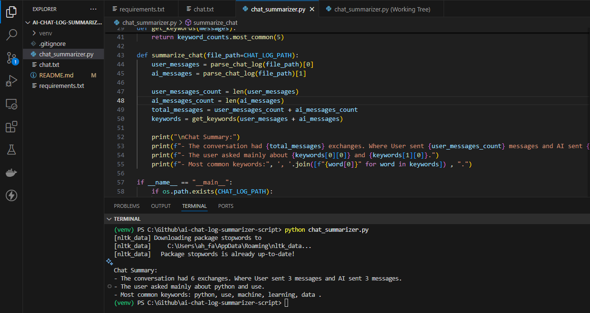

# ai-chat-log-summarizer-script

## Project Description
AI Chat Log Summarizer is a Python-based tool that reads chat logs between a user and an AI, parses the conversation, and produces a simple summary including message counts and frequently used keywords.

## Features
- Parse chat logs and separate messages by speaker (User and AI).
- Count the total number of messages, user messages, and AI messages.
- Extract the top 5 most frequently used keywords, excluding common stopwords.
- Automatically determines the main topics of the conversation.

## Requirements
- Python 3
- nltk

## Installation 
1. Clone the repository:
```bash
git clone https://github.com/capt-farvez/ai-chat-log-summarizer-script.git
```
2. Create a virtual environment and activate it (optional but recommended):
```bash
python -m venv venv

.\venv\Scripts\activate  # On Windows

source venv/bin/activate  # On macOS/Linux
```
3. Install dependencies:
```bash
pip install -r requirements.txt
```

## Running the Script
Run the script:
```bash
python chat_summarizer.py
```
- Ensure `chat.txt` file have in the same directory with the chat log content. Because the script reads the file directly.

## Example
Sample `chat.txt` content:
```
User: Hi, can you tell me about Python? is is is is is is is is is .
AI: Sure! Python is a popular programming language known for its readability.
User: What can I use it for?
AI: You can use Python for web development, data analysis, AI, and more.
User: Can you explain what machine learning is?
AI: Certainly! Machine learning is a field of AI that allows systems to learn from data.
```

Expected Output:
```
Chat Summary:
- The conversation had 6 exchanges. Where User sent 3 messages and AI sent 3 messages.
- The user asked mainly about python and use.
- Most common keywords: python, use, machine, learning, data .
```

## Screenshot

